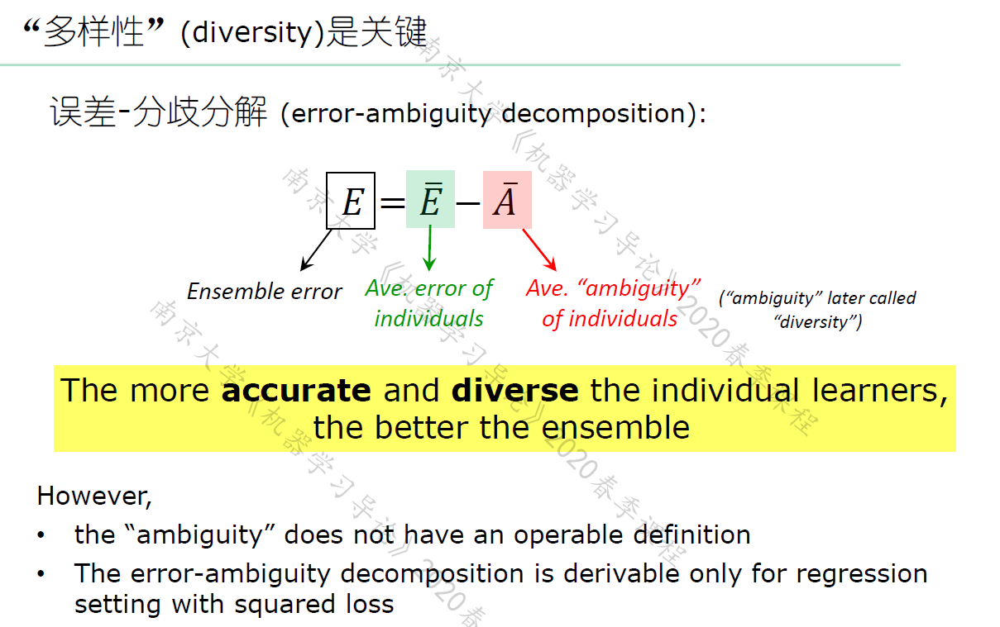
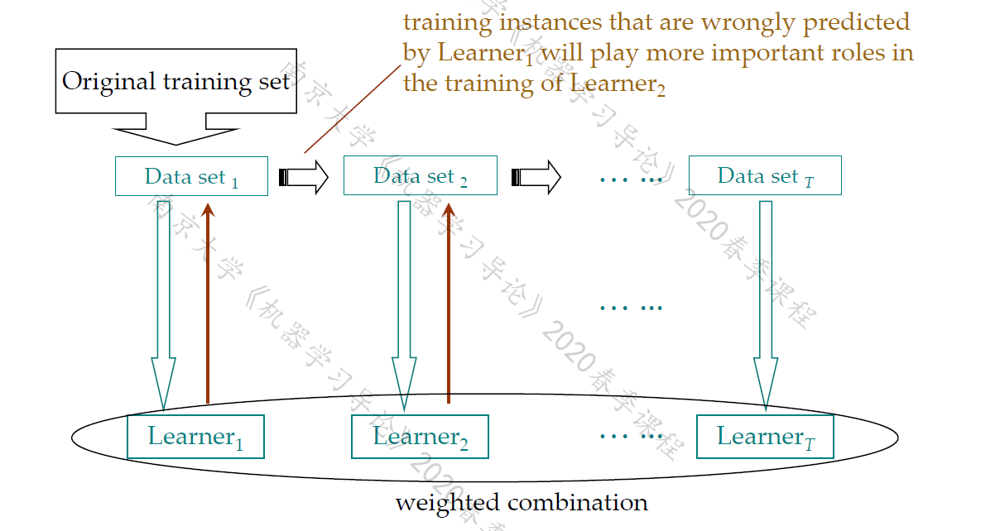
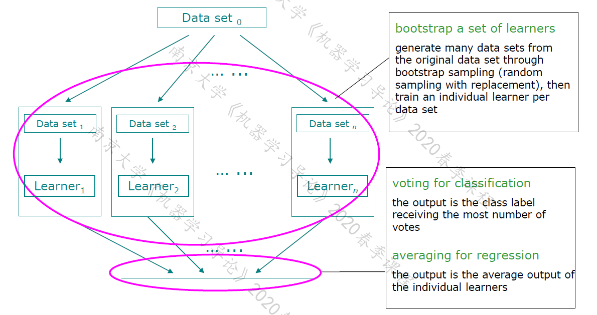

# AI notes

简要知识点.

### 神经网络

+ MP神经元模型, 神经元接收到的总输入值 与 神经元的**阈值**进行作差, 然后通过激活函数.
+ sigmoid函数形式, 求导.
+ 感知机: **两层**神经元组成. 只能处理线性可分.
+ 多层前馈神经网络: 与下一层神经元相连, 不存在同层/跨层连接.
+ 误差逆传播算法, 反向传播算法, BP算法, 以目标的负梯度方向对参数进行调整. 运用链式法则. 累积误差你传播算法: 最小化训练集上的累积误差.
+ 一轮的学习: epoch.
+ 由于强大的表示能力, 常 过拟合, 解决方法: 1. early stopping, 当训练集误差降低但验证集升高时. 2. 正则化: 在loss函数中增加描述网络复杂度的部分.
+ 跳出局部极小(大多启发式算法, 理论上缺乏保障): 
  + 不同参数初始化, 从多个不同的初始点开始. 
  + 模拟退火, 在每一步以一定概率接受比当前更差的结果. 接受次优解的概率逐渐降低. 
  + 使用随机梯度下降, 即便陷入局部极小点, 计算出的梯度也可能不为零从而跳出局部极小.

### 集成学习

+ 同质集成: 其中个体学习器称为"基学习器", 集成中只包含同种类型的个体学习器.
+ 异质集成: 其中个体学习器称为"组件学习器", 个体学习器由不同的学习算法生成.
+ 集成学习获得比单一学习器显著优越的**泛化性能**.
+ 弱学习器: 泛化性能略优于随机猜测的学习器.
+ 个体学习器应 "好而不同", 要有一定的准确性, 学习器之间又要有差异.
+ Boosting: 个体学习器之间存在强依赖关系, 必须串行生成的序列化方法.
+ Bagging和随机森林: 不存在强依赖关系, 可同时生成的并行化方法.A

#### AdaBoosting

+ 先训练出一个基学习器, 做错的样本在之后会受到更多的关注, 基于调整后的样本分布 来训练下一个基学习器, 一个基学习器的权重就是它错误率的一个函数(loss求偏导可证), 最后结果是这些基学习器的线性组合.
+ P174 图8.3 伪代码
+ 标准AdaBoost只能用于二分类任务.

#### Boosting

基学习器能对特定的数据分布进行学习, 在训练的每一轮中, 根据样本分布为每个训练样本重新赋予一个权重.

+ 无法接受带权样本的基学习算法: "重采样法", 在每一轮学习中根据样本分布重新进行采样.
+ 算法在训练的每一轮都要检查基学习器是否比随机猜测好. 否则抛弃.
+ 从偏置-方差分解的角度: Boosting 关注的是降低偏置.

#### Bagging与随机森林

基学习器训练数据的考虑采样是相互有交叠的.

##### Bagging

自助采样法: $m$ 个样本的数据集, 随机取出一个放入采样集中, 之后仍然会放回初始数据集, 这样下次采样时仍可能被选中. 不被采样到的概率: $(1-\frac{1}{m})^m$, 取极限 所以每个基学习器只使用了初始训练集中约63.2%的数据.

+ 采样出 $T$ 个含 $m$ 个训练样本的采样集.
+ 这 $T$ 个基学习器结合, Bagging 常用简单投票法(分类任务), 简单平均法(回归任务). 

+ 优点: 1. 能用于回归, 多分类任务, 2. 由上63.2%, 剩下的数据可以作验证集(泛化性能的"包外估计")

+ 从偏置-方差分解角度, Bagging关注降低方差.

##### 随机森林

基决策树的每个结点, 都是先从该结点的属性集合中随机选择一个包含$k$个属性的子集, 然后从这个子集里选择一个最优属性进行划分. 推荐$k = log_2 d$.

#### 结合策略

学习器结合带来的好处:

+ 学习任务假设空间大, 多个假设在训练集上达到同样性能, 若使用单学习器可能导致选到泛化性能差假设, 但是结合多个学习器可以减小这个风险.
+ 降低陷入局部极小的风险.
+ 从表示角度, 如果学习任务的真实假设不在当前学习算法考虑的假设空间中, 学习器结合可以带来更宽泛的表示.

结合策略:

+ 平均法: 个体学习器性能相近时.
+ 加权平均法: 集成学习研究的出发点, 通过不同方式来确定加权平均中的权重. 个体学习器性能差异较大时.
+ 投票法: 分类问题, 请注意还有加权投票法.
  + 个体学习器输出类标记时: 硬投票.
  + 个体学习器输出类概率时: 软投票.

##### 学习法

通过另一个学习器进行结合, 用于结合的是次级学习器或元学习器.

### 决策树

目的: 产生一棵泛化能力强的决策树.

#### 构建

+ (递归) 算法过程 (传入训练集 $D$, 属性集 $A$)

  + 递归返回: 标记为叶结点

    1. $D$ 全属于同一类别, 无需划分.
    2. $A$ 为空, 或者是 所有样本在所有属性上取值相同, 无法划分. **设定为该结点所含样本最多的类别**.
    3. $D$ 为空, 不能划分. **设定为父结点所含样本最多的类别**. (注意此情况在下面判断)

    

  + 从 $A$ 中选择最优的划分属性.

  + 最优的划分属性的取值, 就是分支.

    + 如果最优划分属性的某个取值上为空, 就是上面递归返回的条件3. 直接根据$D$中含样本最多的类标记为叶结点即可.
    + 否则继续递归.

+ 如何选择最优划分属性:

  + 信息熵: $p_k$ 是第$k$类样本所占比例
    $$
    Ent(D) = - \sum_{k = 1}^{|\mathcal Y|} p_k \ log_2 p_k
    $$
    上式值越小, $D$ 的纯度越高.

  + 信息增益: 样本数越多的分支结点的影响越大, $D^v$是属于 属性某个取值 的样本集合.
    $$
    Gain(D, a) = Ent(D) - \sum_{v = 1}^V \frac{|D^v|}{|D|} Ent(D^v)
    $$
    ID3 决策树即用信息增益作为划分准则.

    信息增益越大, 意味着利用属性$a$来划分的纯度提升越大.

    信息增益对可取值数目较多的属性有所偏好.

    所以增益率(C4.5决策树)

  + 增益率:
    $$
    Gain_ratio(D, a) = \frac{Gain(D, a)}{IV(a)}
    $$
    其中 $IV(a)$ 固有值:
    $$
    \mathrm{IV}(a)=-\sum_{v=1}^{V} \frac{\left|D^{v}\right|}{|D|} \log _{2} \frac{\left|D^{v}\right|}{|D|}
    $$
    C4.5: 先选信息增益高于平均的, 再从中选择增益率最高的.

    

#### 剪枝

降低过拟合风险. 是否剪枝看验证集精度会不会下降.

+ 预剪枝: 

  在结点划分前估计.

  基于贪心本质. 同时降低了训练时间开销和测试时间开销.

+ 后剪枝:

  完整的决策树自底向上地对非叶结点进行考察.

后剪枝策略通常比预剪枝保留了更多的分支. 一般情况下后剪枝泛化性能优于预剪枝. 但训练时间开销大.

#### 连续值处理

+ 连续属性离散化: C4.5. 采用二分法:

  连续属性取值有$n$个, 那么对应了$n - 1$个划分点:
  $$
  T_{a}=\left\{\frac{a^{i}+a^{i+1}}{2} \ | \ 1 \leqslant i \leqslant n-1\right\}
  $$
  若当前结点划分属性为连续属性, 该属性 还可以作为其后代结点的划分属性.

#### 缺失值处理

